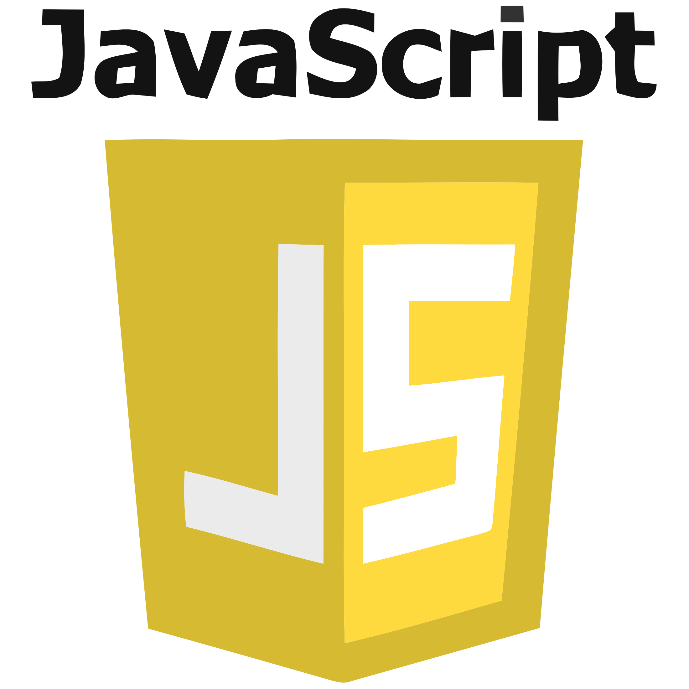
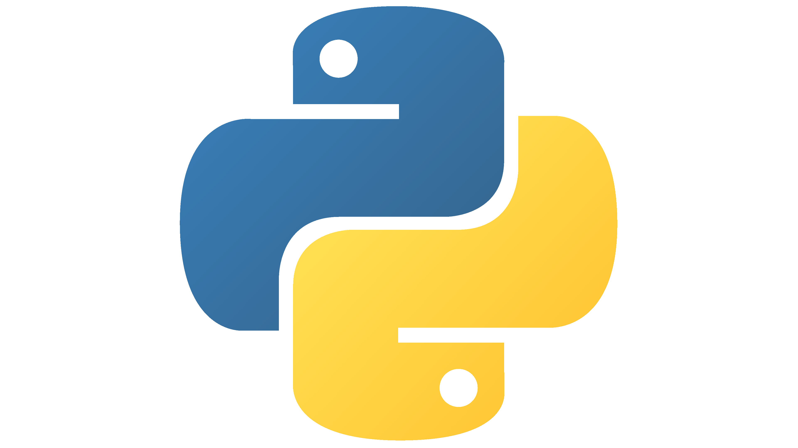

# Olá, meu nome é Raphael.
Sou aluno de Análise e Desenvolvimento de Sistemas na instituição ETEC.

# Tecnologias e Ferramentas
Aqui estão as tecnologias que venho estudando e utilizando em meus projetos:

  
  
  
  
  
  

<!--
**raphaelduca2002/raphaelduca2002** is a ✨ _special_ ✨ repository because its `README.md` (this file) appears on your GitHub profile.

Here are some ideas to get you started:

- 🔭 I’m currently working on ...
- 🌱 I’m currently learning ...
- 👯 I’m looking to collaborate on ...
- 🤔 I’m looking for help with ...
- 💬 Ask me about ...
- 📫 How to reach me: ...
- 😄 Pronouns: ...
- ⚡ Fun fact: ...
-->
